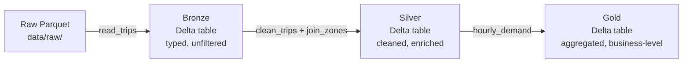

# DataForge AI

A production-style, end-to-end data + AI platform built to demonstrate
modern data engineering: **PySpark → Delta Lake → Databricks → Azure → AI/RAG
layer**, using real NYC TLC Yellow Taxi trip data (~9.3M rows across
Jan–Mar 2023).

This is a learning/portfolio project, structured the way a real engineering
team would build it — a tested, installable Python package backing every
notebook, a medallion-architecture lakehouse, and a phased roadmap from
local Spark fundamentals through to a full AI layer.

Full roadmap: [docs/learning_plan.md](docs/learning_plan.md) ·
Progress tracker: [docs/roadmap_progress.md](docs/roadmap_progress.md)

## Architecture



- **Bronze**: raw trip data cast to correct types, unfiltered — a durable,
  replayable copy of what was ingested (including known-bad source
  timestamps, preserved intentionally).
- **Silver**: cleaned (invalid fares, bad date ranges, duplicate trips
  removed) and enriched with pickup/dropoff zone + borough names via a
  join against the NYC TLC zone lookup table.
- **Gold**: aggregated, business-ready tables (e.g. hourly demand by
  borough, busiest-hour ranking, cumulative trip totals).

All three layers are built from the same shared, tested logic in
[`src/dataforge_ai`](src/dataforge_ai) — no business logic is duplicated
between notebooks or across storage layers.

## Project structure

```
notebooks/    Teaching notebooks — one per concept, run in order
src/dataforge_ai/   Installable package: read/clean/join/aggregate logic
tests/        pytest unit tests against small synthetic DataFrames
data/raw/     Source Parquet + zone lookup CSV (fetched, not committed)
data/delta/   Bronze/Silver/Gold Delta tables (generated, not committed)
scripts/      Dataset download script
docs/         Learning plan + roadmap progress tracker
```

### Notebooks (in order)

| # | Notebook | Covers |
|---|---|---|
| 01 | [fundamentals](notebooks/01_fundamentals.ipynb) | SparkSession, driver/executors, lazy evaluation, partitions |
| 02 | [cleaning_and_etl](notebooks/02_cleaning_and_etl.ipynb) | Null handling, dedup, invalid-row filtering |
| 03 | [joins](notebooks/03_joins.ipynb) | Broadcast vs. shuffle joins, left vs. inner, `.explain()` |
| 04 | [aggregations_and_windows](notebooks/04_aggregations_and_windows.ipynb) | `groupBy`, `rank`/`dense_rank`, running totals via window frames |
| 05 | [performance_tuning](notebooks/05_performance_tuning.ipynb) | Skew, shuffle cost, caching, Adaptive Query Execution |
| 06 | [delta_lake_fundamentals](notebooks/06_delta_lake_fundamentals.ipynb) | ACID transaction log, schema evolution, time travel, `MERGE`, medallion architecture |

## The `dataforge_ai` package

Editable-installed (`pip install -e .`) inside the Docker image, so
notebooks import shared logic instead of duplicating it:

```python
from dataforge_ai import read_trips, clean_trips, join_zones, hourly_demand
```

Unit-tested against small synthetic DataFrames (fast, deterministic, no
Spark cluster or real dataset needed):

```bash
pytest tests/ -v
```

## Local development

Requires Docker.

```bash
docker compose up -d
```

- JupyterLab: [http://localhost:8888](http://localhost:8888) (token: `pyspark`)
- Spark UI: [http://localhost:4040](http://localhost:4040) (while a job is running)

The dataset is fetched via:

```bash
python scripts/download_data.py
```

which downloads 3 months of NYC TLC Yellow Taxi Parquet files + the zone
lookup CSV into `data/raw/`.

### Notes on the local environment
- `SPARK_DRIVER_MEMORY` is set via `docker-compose.yml`'s `environment:`
  block, not via `SparkSession.builder.config(...)` — in local/client mode
  the JVM heap size is fixed by the launcher script before Python code
  runs, so it can't be changed from within a notebook.
- `docker exec` sessions do **not** inherit the `PYTHONPATH` that Jupyter's
  entrypoint hooks set up for the notebook server — running `pytest` or any
  script via `docker exec` requires passing `PYTHONPATH` explicitly (see
  `Dockerfile` comments for the exact value).

## Roadmap

- **Phase 0 — Foundations** ✅ complete: PySpark fundamentals, cleaning/ETL,
  joins, aggregations/windows, performance tuning, tested package structure.
- **Phase 1 — Databricks + Delta Lake** (in progress): Delta Lake
  fundamentals and medallion architecture complete locally; Databricks
  workspace, jobs/workflows, and Structured Streaming next.
- **Phase 2 — Azure + modern data stack**: Data Factory, ADLS Gen2, Azure
  Databricks, dbt, Terraform, CI/CD.
- **Phase 3 — AI layer**: embeddings, vector databases, RAG pipeline, LLM
  evaluation, MLOps fundamentals.
- **Phase 4 — Production hardening + portfolio polish**.

See [docs/roadmap_progress.md](docs/roadmap_progress.md) for the detailed,
continuously-updated checklist.
